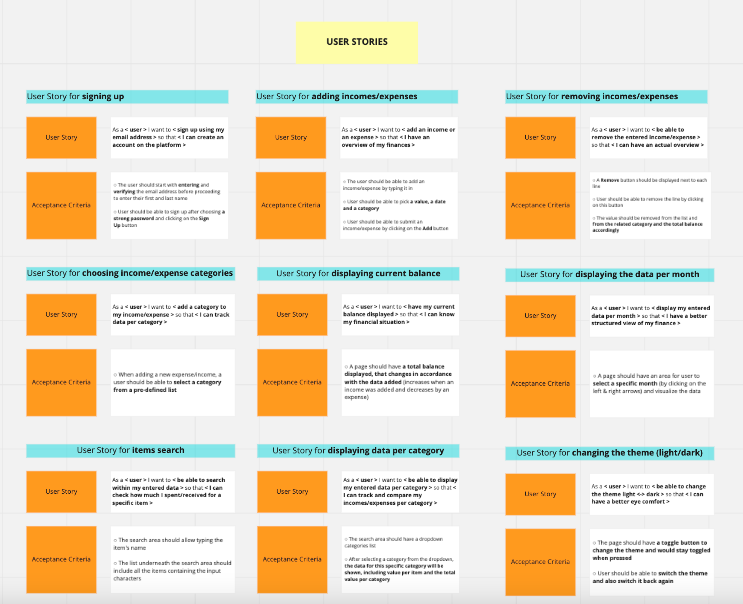
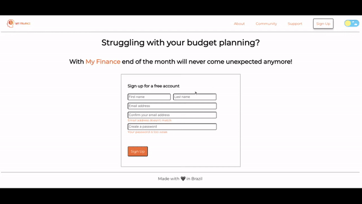

# My Finance App

This project was created as a conclusion of React module during the Ironhack Web Development Bootcamp in June, 2022. 

The main objective of the My Finance app is to help user better track personal expenses in the daily life.

## Table of Contents

* [Project Workflow](#project-workflow)
* [Tech Stack](#tech)
* [Screenshots](#screenshots)
* [Project Status](#project-status)
* [Room for Improvement](#room-for-improvement)
* [Project presentation](#project-presentation)
* [About Us](#about-us)

## Project Workflow

### 1. Product definition, research and analysis

During this phase we set the product value propositions which helped us to define the future app functionality. Based on this, 9 user stories, an app basic structure and the wireframes have been created (using Miro and Figma). 

### 2. Development phase

Actual app development

### 3. Delivery

The project delivery happened on July, 2nd, 2022 in form of presentation to the Lead Teacher [Nilton de Freitas](https://github.com/oniltos) and Teacher Assistant [Felipe Osório](https://github.com/Briofita09).

## Tech Stack

HTML, CSS, JavaScript, React

## Screenshots

## Project Status
 
 _finished_

## Room for Improvement

#### 1. Create a year switcher to view the expenses for the whole year
#### 2. Create different category tags in different colours
#### 3. Implement a real sign up form
#### 4. Make the expenses display in red, and incomes in green in the items table
#### 5. Improve the colour theme for the dark mode

## Project Presentation

[Click here](https://www.canva.com/design/DAFE1KYLYmo/dDpO1ziTEOrpigZZsktJ8Q/view?utm_content=DAFE1KYLYmo&utm_campaign=designshare&utm_medium=link2&utm_source=sharebutton) to watch the project presentation!

## 🚀 About Us
- [Bruno Novis](https://www.github.com/bru9is) - engineer with more than 10 years of experience in the technology area. At the moment in career transition to Software Development. 
- [Ksenia Busquet](https://www.github.com/kseniabusquet) - customer-oriented specialist with excellent communication and interpersonal skills. Passionate about helping people solve complex issues. Currently transitioning into Software Development. Twice an expat.

